# Humanize Book

<!-- 研究底稿、时间序语料和引用索引见 materials/README.md。 -->

## 序言

2026 年 3 月，我加入了 Humanize 社群。此后的几个月里，我有幸近距离见证了 Humanize 从 1.0，到 2.0 原型，再到 3.0 方向的演进，并深入参与了 Humanize 1.0 的开源贡献。

这并不是一条整齐的“版本升级”路线。

Humanize 1.0 首先回答的是：怎样让一个反馈循环真正跑起来？它以 Ralph Loop 和独立的 Codex Review 为核心，让 Agent 在实现、审查和修正之间持续迭代，那这实际解决了怎么稳定地去做长程任务这个问题。到了 2.0，问题变成了：人能否用一套中间表示来构造、检查和复用 Flow？3.0 又把问题向前推了一步：Flow 能否由 Agent 在运行过程中生成和修改？如果用社群里更直观的说法概括，就是从 Ralph Loop，走向 Loop Engine，再走向 Agent-mutable Dynamic Workflow。

这条时间线贯穿了整本“小册子”。它记录的不只是 Humanize 自身的变化，也映照了 Agent，尤其是 Agent Harness 如何一点点改变开发方式。更完整的工程节点与社群讨论，可参见[《Humanize 演进关键节点导览》](materials/timeline/01_Agent发展史_关键节点导览.md)。

在技术演进之外，另一个同样珍贵的部分，是围绕 Humanize 形成的开发者贡献社区。社区规模不算大，但讨论密度和动手能力都很高。许多判断并非事后总结，而是在模型发布、仓库更新、实验成功或失败的当下自然生长出来的。大家一边使用 Humanize，一边质疑它、修改它，也不断重新理解什么才是有效的 Agent 工程。我一直想把这些散落在群聊里的见解保存下来。

因此，我使用 OCR 技术处理了群内聊天记录（已做匿名化和敏感数据脱敏），并以时间为主线进行筛选和整理。OCR 转录难免存在错字、重复和上下文缺失，这本书也不会把聊天记录原封不动地搬出来。口水话和无关闲聊会被删去，必要处会做轻度润色，但我们会尽量保留原意、分歧与当时的不确定性。

《Humanize Book》并不打算成为一本盖棺定论的严谨著作。它首先是一份持续更新的社区记录，保存大家围绕 Humanize、Agent 与 Agent Harness 交流过的 idea、经验和判断。对于群聊中提到的新闻、技术概念、GitHub 仓库及外部讨论，我们会尽量寻找一手资料相互印证，并将它们作为延伸学习材料提供给读者。

我之所以认为 Humanize 值得被专门研究，是因为它有很强的实践性。从 Ralph Loop、独立 Review、目标保持和熔断，到 Flow IR 与 Dynamic Workflow，它的大多数设计都来自具体项目中的问题、失败和修正，而不是从一套抽象理论出发。每一个留下来的工程点，都试图回答一个真实问题：怎样让 Agent 在更长的任务里持续工作，同时不偏离目标，并且接受外部校验。

截至 2026 年 8 月，[Humanize](https://github.com/PolyArch/humanize) 在 GitHub 上约有 1.4k Star。与许多更受关注的 Agent Harness 相比，它的规模并不算大，但我仍然认为它被低估了。沿着社群内部所说的 1.0、2.0、3.0 三个阶段去理解它——从一个能工作的 Loop，到表达和运行 Flow 的系统，再到由 Agent 参与构造与修改 Flow——未必能得到一套唯一正确的答案，却能看到 Agent Harness 最核心的一组问题是怎样被逐步提出、试错和重写的。

我希望读完这本小册子后，大家记住的不只是几个流行概念，而是能看见模型、工具与开发者之间的关系如何一步步变化。当你开始设计自己的 Agent 时，能够更清楚地判断为什么需要 Loop、什么时候需要独立 Review、自治的边界应该放在哪里，以及为什么一个足够简单的 Harness 有时反而更可靠。如果这本记录能带来这些具体的启发，它的目的就达到了。

> PS: 全文使用 Typeless 口述转文字，由 ChatGPT Codex 5.6 Soul Max 整理润色，所以整体是比较偏口语化和轻松诙谐的节奏。

## 第一章｜Humanize 的诞生

如果把 Humanize 放进整个 Agent 发展史，它的诞生或许算不上一个醒目的世界性事件。但从我们这个社区向外看，它恰好构成了一条自然的分界线：在它之前，我们更多是在追赶模型能力的变化，观察 Claude Code 能把一次任务推到多远；在它之后，讨论的重心逐渐移向另一件事——怎样给模型建立目标、状态、反馈和边界，让它在真实工程里持续工作。

因此，本章并不打算证明 Humanize 改变了 Agent 的历史。它只是选择了一个离我们最近、也最便于观察的坐标：以 Humanize 的诞生为界，看一看 2026 年初 Agent 工程发生了什么，以及社区成员如何在几乎同一时间，用自己的项目去检验这些变化。

### 一把为自己磨的镰刀

Humanize 最初并不是一项按照产品路线图规划出来的 Agent Harness。作者刘思皓博士后来在群里回忆，它只是为了方便自己写代码而做的一个小工具，也是服务于加速器研究的 side project；更早的设计目标，甚至只是把一份 spec 翻译成 Agent 能够执行的计划。它的出发点并不宏大。

公开代码留下了一条更具体的演变路线。Humanize 1.0 的前身是 [GAAC（GitHub-as-a-Context）](https://github.com/SihaoLiu/gaac)，它曾尝试用 GitHub Issues、PR、Projects 和复杂的 Agent 交互来保存长程上下文。刘思皓后来回忆，GAAC 一度包含超过 60 个 Agent 的交互；经过实际失败，他把这些复杂结构大幅删去，只留下最有用的一条主线：Ralph Loop 加独立 Codex Review，再配上 Goal Tracker 与停滞熔断。2026 年 1 月 12 日提交的 [Humanize v1.0.0](https://github.com/PolyArch/humanize/commit/888451dbe0baf71b006f03961b7eb06939c100bf)，已经完整表达了这套骨架。

*图 1：直接引用 Humanize 官方仓库的 RLCR 工作流图。*

群里后来反复提到的一个早期用例，是对 gem5 构建系统的重构。[gem5 PR #2969](https://github.com/gem5/gem5/pull/2969) 尝试用 CMake + Ninja 替换长期使用的 SCons，同时加入一套可并行存在的 Bazel 构建系统。这个改造涉及五百多个文件，还要保留 ISA Parser、SLICC、SimObject 代码生成等既有链路，并验证两套构建系统得到一致的对象集合。它不是一个为了展示 Agent 而刻意设计的小样例，而是一个有历史包袱、有兼容要求、也要接受上游审查的真实工程问题。

如果用一个朴素的比喻来概括，Humanize 就像一把意外磨得很锋利的镰刀。最初只是因为眼前有一片麦子，想把它割得快一点，于是开始磨刀；等刀磨好以后，大家才发现，它处理的不只是一种麦子，也不只适用于一个项目。一个为个人研究服务的小工具，由此逐渐显露出 Agent Harness 的通用价值。

### Humanize 之前：模型开始进入真实工程

Humanize 诞生前后，最先带来冲击的仍然是模型能力，但交互方式已经先走了一步。2025 年 2 月，Anthropic 将 [Claude Code](https://www.anthropic.com/news/claude-3-7-sonnet) 作为研究预览带进终端，开发者开始把完整工程任务交给模型，而不只是让它补一个函数。到同年 7 月，Geoffrey Huntley 公开总结 [Ralph Wiggum Loop](https://ghuntley.com/ralph/)：用一个简单的持续循环，把同一目标反复交给 Agent，让代码、测试失败和 Git 历史成为下一轮的上下文。Anthropic 随后也提供了基于 Stop Hook 的 [Ralph Wiggum 插件](https://github.com/anthropics/claude-code/tree/main/plugins/ralph-wiggum)。这条路线把注意力从“一次回答够不够好”移向了“系统能不能继续迭代”；Humanize 1.0 没有发明 Loop，而是在这个基础上加入独立 Review、目标保持和熔断。

2026 年 2 月 5 日，Anthropic 研究员 Nicholas Carlini 发布了[《Building a C compiler with a team of parallel Claudes》](https://www.anthropic.com/engineering/building-c-compiler)。实验让 16 个 Claude Opus 4.6 Agent 并行工作，接近 2,000 次 Claude Code 会话，在两周内产生约 10 万行 Rust 代码，API 成本约 2 万美元；得到的 [Claude's C Compiler](https://github.com/anthropics/claudes-c-compiler) 可以构建 x86、ARM 和 RISC-V 上的 Linux 6.9。这个结果并不等于“Claude 已经重造了 GCC”：当时公开的版本仍然依赖外部工具链，生成代码的质量和兼容性也有明显边界。但它把并行 Agent 的工程尺度推到了足以让系统软件开发者认真对待的位置。

同样重要的是，这个实验背后的 Harness 并不神秘。它的主体只是一个持续启动 Claude 的循环、隔离的容器、一个共享 Git 仓库，以及用文本文件实现的任务锁。Agent 之间没有复杂的通信协议，也没有一个全知全能的总调度器。真正花费作者大量精力的，是测试、执行环境和反馈：如果验证器不可靠，Agent 只会更快地把错误方向做大。

当时这个新闻对我的冲击也很直接，用社区的话来说，宛如核弹爆炸，瘫坐在椅子上，于是我赶紧把 Agent 使用起来，并在自己熟悉的领域去做了一些快速的验证：先让 Agent 用 Rust 重写 QEMU TCG，形成 [tcg-rs](https://github.com/zevorn/tcg-rs)；随后又完成 [cosim-gpu](https://github.com/gevico/cosim-gpu) 的第一版，把 QEMU 与 gem5 的 AMD MI300X 模型连接起来。这些项目在这里不需要展开。它们的作用，是让我亲眼确认 Claude 的工程能力已经跨过了某个门槛，同时也看到单点对话在长任务中的局限。过程分别记录在[《5 天，4.5 万行 Rust：用 Claude + Codex 重写二进制翻译引擎》](https://mp.weixin.qq.com/s/nDMDtWLwFqlYCr8dNk5Pwg)和[《只用两天：我用 Claude 把 MI300X GPU 搬进了 QEMU》](https://mp.weixin.qq.com/s/LG_PSQyQApr6zeilCCXLNg)中。

需要说明的是，这些初版并不是 Humanize 的成果，当时我还没有深入使用 Humanize。它们只是一次能力体验，并由此把我带到 Humanize 1.0 面前。在 3 月 28 日的 [OS2ATC 2026](https://os2atc.cn/) 上，我展示了 tcg-rs 与 Humanize；从这里开始，本书的叙述重点也从“Claude 能不能完成一个复杂项目”，转向“Humanize 怎样让这种能力持续、可控并接受外部 Review”。后来 tcg-rs 扩展为 [Machina](https://github.com/zevorn/machina)，cosim-gpu 也继续迭代，它们将作为 Humanize 的后续验证窗口，而不再占用本章的大篇幅。

### 第一次摆脱单点交互

我第一次认真使用 Humanize 1.0 时，最明显的感受不是“模型突然变聪明了”，而是自己终于可以离开单点交互。

此前使用 Claude Code，即使模型能力很强，我仍然要留在对话旁边：看它做到哪里，发现偏差，补一句提示，再要求它继续。任务一旦拉长，人就会变成维持循环运转的那部分。Humanize 将这种协作的方式完全改变了。

我开始不需要待在 TUI 前面去和它做每一轮的 battle to battle，而是可以先去把目标约束和验收条件想清楚，把 Spec、Plan 都制定清晰，再去触发一个 Humanize 的长程任务来做这些事情。我的整个开发协作就变成了：在白天或者睡觉前想清楚我要做的是哪些事情，然后在睡前把它交给 Humanize 来完成，第二天早上我醒来之后去验收。

另一个直观的感受就是我的 Token 消耗，从原来的可能一天达不到几百万，后面变成了一亿、十亿这样的量级。

后来复盘 Machina 的一个月实践时，这种变化已经可以用数据描述：11 份计划、12 个 Humanize Session、77 轮 Claude Build × Codex Review，以及 407 个提交。这些数字本身不能证明代码一定正确，却说明它不再是一段被包装得更长的聊天，而是一个能够留下计划、证据、审查结果和迭代轨迹的工程循环。更完整的复盘见[《月烧 6300 刀才明白：Agent 团队飞轮是怎么转起来的》](https://mp.weixin.qq.com/s/S45KRGmDCCLu5GoBa7v2bQ)。

PPT 是另一个更直观、也更容易被低估的例子。当时模型原生编辑 PPT 的能力还不稳定，我第一次用 Claude 画出的结构图经常出现箭头没有接到组件、连线歪斜、间距失衡等问题。所以我尝试使用 Humanize 来做这个事情，比较反直觉的是 Humanize 做的非常“漂亮”，这里的漂亮不是华丽，而是规整：通过 RLCR 中一轮轮的 Reviewer 检查连接关系、排序、间隔和对齐，Builder 再逐项修正，直到页面结构清楚。它没有让模型在第一轮获得设计天赋，而是把原本主观、零散的“不太对劲”，转化成可以不断检查和修复的问题。

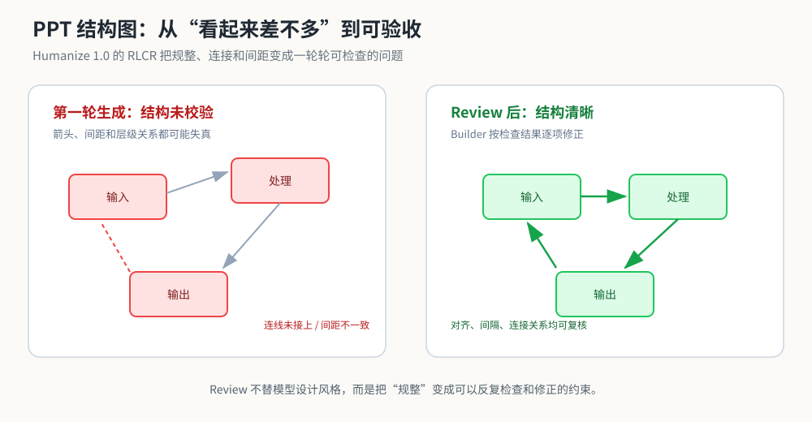

*图 2：这里的“漂亮”主要指结构规整：连线、间距、排序和对齐都能被逐项检查。*

这正是 Harness 最早让我信服的地方：它不必在单次生成中战胜模型的缺点，只要能够稳定看见缺点，并让下一轮有机会改掉它。

### 控制、协作与远程入口

3 月 20 日，群里谈到 OpenAI 的 Harness Engineering 时，有人给出了一个极简的概括：**Harness 工程就是控制论。**

OpenAI 在 2 月发布的[《Harness engineering: leveraging Codex in an agent-first world》](https://openai.com/index/harness-engineering/)中，披露了一个由 Codex 从零构建的内部产品：早期团队先有 3 名、后来增至 7 名工程师，约五个月形成近百万行代码、1,500 个 PR，产品代码没有人工手写。文章真正值得关注的并不是代码量，而是人的工作发生了什么变化：人不再逐行生产代码，而是设计环境、组织仓库知识、暴露日志与指标、把架构边界变成可机械检查的规则，再让 Agent 在这些约束中工作。

从社区实践出发，我们很自然地把它理解成一个控制系统：Spec 和验收条件是参考目标，Builder 是被控制对象，测试与独立 Reviewer 提供观测，Goal Tracker 保存状态，循环与熔断负责继续、纠偏或停止。这不是 OpenAI 给出的正式定义，而是社区用来理解 Harness 的工程类比。它提醒我们，真正的问题不是如何写出更长的 Prompt，而是如何让“目标—执行—观测—修正”这条反馈链闭合。

3 月 23 日，讨论转向多 Agent：究竟应该使用由 Leader 统一调度的 Subagents，还是让 Agent 彼此通信、形成更接近 Swarm 或 Agent Teams 的结构？群里并没有得到一个抽象的标准答案，反而迅速落到了几个很具体的问题上：Leader 的上下文和 I/O 会不会成为瓶颈？不同 Agent 之间的直接通信是否会形成对人和主 Agent 都不可见的黑盒？工作是否应该通过文件与 Worktree 交接？并行增加的到底是有效吞吐，还是协调成本？

讨论中较强的一派主张：实现型子任务交给 Subagent，但结果经由文件回到 Leader；Agent 之间未经主控的沟通应当谨慎，因为不可观察的协作很难审计。另一派则指出，当规模继续扩大，单一 Leader 同样会被上下文和消息压垮，探索型任务也未必适合严格的层级调度。后来 Anthropic 的[多 Agent 使用指南](https://claude.com/blog/building-multi-agent-systems-when-and-how-to-use-them)给出了相近的成本侧证：同等任务下，多 Agent 通常消耗单 Agent 约 3—10 倍 Token；真正稳定获益的场景主要是上下文隔离、可并行任务和专业化工具，而黑盒验证之所以有效，恰恰是因为它需要传递的上下文很少。

这场讨论的重要性，不在于提前判定 Subagents 一定战胜 Agent Teams，而在于社区开始把 Agent 数量和协作拓扑分开看。开很多 Agent 并不自动构成好的 Agent Team；通信是否可见、任务边界是否独立、结果能否被外部验证，往往比数量更重要。

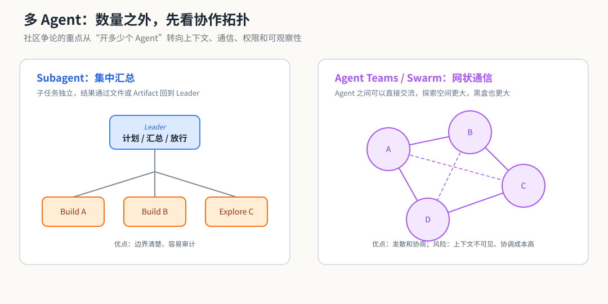

*图 3：Subagent 更强调隔离和集中汇总，Agent Teams / Swarm 更强调直接通信与探索。*

同一时期，Humanize 之外也已经出现了一批很强的单点能力。最典型的是 [Superpowers](https://github.com/obra/superpowers)。它的主要作者是 Jesse Vincent，背后团队是 Prime Radiant；Superpowers 也不是单个 Skill，而是一套由可组合 Skills 构成的软件开发方法。群里最认可的是它的 Brainstorming：先连续追问，把模糊愿望整理成干净的 spec 和 plan，再交给 Humanize 执行。有人把当时的工作流概括为：“许愿 → Superpowers 提问 → Humanize 执行。”但也有人发现，在需要长期盯实验、目标已经足够明确的任务里，过重的 Brainstorming 会产生负收益。Skill 的价值从一开始就不是越多越好，而是能否在合适的阶段补上一个明确缺口。

3 月 30 日还有一个轻松的小插曲。[Boris Cherny 当天介绍](https://x.com/bcherny/status/2038454336355999749)了 Claude Code 中两种不同的会话迁移方式：`/teleport` 把云端 Session 接回本地终端，`/remote-control` 则让手机或网页控制仍在本机运行的 Session。按照[官方 Remote Control 文档](https://code.claude.com/docs/en/remote-control)，本地环境、文件和工具并没有搬到云端，手机只是一个远程窗口。它没有让开发彻底脱离电脑，却把人从电脑桌面前解放了出来。我当时开玩笑说，我们这帮写代码的终于也能像高级金融白领一样，端着咖啡在星巴克坐一天，手机上刷的不是股票看板，而是几个 Agent 的运行状态。

玩笑背后其实是一种工作界面的变化：当 Agent 可以持续运行，人最需要的未必还是一块更大的代码编辑器，而可能是一块用来查看进度、接收告警和做关键决策的控制面板。

### 让真实失败成为 Harness 的反馈

Humanize 进入快速实践期后，大家很快遇到一个现实问题：怎样测试 Harness 本身？普通单元测试可以检查脚本是否能运行，却很难覆盖 Agent 在一个真实仓库中连续工作十几轮以后，出现的目标漂移、虚假完成、修复—回退振荡和停滞误判。

实践的尺度也在迅速拉长。最初是让 Humanize 在人睡觉时继续工作，随后群里开始出现持续数天、一周乃至两周的运行记录，也有人尝试同时启动多个 Humanize，让彼此独立的计划并行推进。这些尝试并不都成功：循环越长、并发越高，错误验证、上下文交接和资源消耗带来的代价也越容易被放大。但正是在这种使用强度下，Harness 的真实问题才会显现出来。

3 月底，Humanize 的开发分支加入了一个很有意思的“沉淀反思”机制：长程任务结束后，由 Agent 回看整段迭代，提炼 Harness 层面的问题；在用户同意后，对本地记录脱敏并交由用户审核，再提交为仓库 Issue。与其先发明一个看起来完整、实际覆盖有限的 Agent Benchmark，不如先让真实项目中的失败反向塑造 Harness。

最早一批 Issue 已经能够说明这套反馈的价值：[Issue #53](https://github.com/PolyArch/humanize/issues/53) 来自一个 23 轮的 RLCR Session，涉及 30 项任务、7 个阶段、37 个提交和 900 多个测试。独立 Reviewer 抓到了 4 个实现者遗漏的关键 Bug，但运行也暴露出新的问题：停滞检测把“围绕同一架构问题持续推进”误判成没有进展，原计划无法容纳中途发现的架构工作，Reviewer 与 Builder 还会因任务顺序产生长期僵持。

紧接着的 [Issue #54](https://github.com/PolyArch/humanize/issues/54) 记录了连续四轮“打地鼠式修复”：每轮只修复同一子系统中的一个局部问题，下一个问题又在 Review 中出现。它由此提出子系统级审计和进度速度信号，并被标记为 `good first issue`。[Issue #55](https://github.com/PolyArch/humanize/issues/55) 则记录了 6 轮中 6 次过早宣称完成；[Issue #57](https://github.com/PolyArch/humanize/issues/57) 记录了 19 轮运行中的修复—回退振荡，以及验收完成后仍然无休止打磨的问题。

这些 Issue 不是用来证明 Humanize 已经成熟，恰恰相反，它们保留了 Humanize 在真实工程中失败的方式。在 Agent Benchmark 尚不成熟的阶段，这可能是优化 Harness 性价比最高的办法之一：不把失败留在某个用户的本地日志里，而是将其脱敏、抽象成可讨论、可实现、可回归检查的工程问题。社区成员既是使用者，也成为了 Harness 的分布式测试者。

### 当方法被模型吃进权重

3 月 24 日，Anthropic 发布了 Prithvi Rajasekaran 撰写的[《Harness design for long-running application development》](https://www.anthropic.com/engineering/harness-design-long-running-apps)。文章使用 Planner、Generator 和 Evaluator 构成的三 Agent 架构，把主观设计标准转化为可评分的指标，并让完整 Harness 最长运行 6 小时。它和 Humanize 都强调独立评价、文件交接与反馈循环，但群里的即时反应却相当冷淡：早期大家几乎会逐篇研究 Anthropic Blog，到这篇文章时，不少人觉得其中可获得的新知识已经变少，甚至认为社区的真实运行时间和问题复杂度已经走得更远。

这不意味着文章没有价值。相反，它在后半部分写出了一个后来反复出现的矛盾：每一个 Harness 组件，都隐含着“当前模型还做不到什么”的假设；模型更新以后，原本必要的 Sprint、上下文重置或 Review，可能变成额外负担，因此应该重新检查并删除已经不再承重的部分。

社区里后来形成了一个很有意思的判断标准。刘思皓曾把它概括为：判断一个 Harness 特性是不是真的有用，可以看下一轮模型会不会把它 built-in。有效的方法会先被写进 Prompt，随后沉淀为 Skill 或 Harness；一旦足够通用、足够高频，它又可能通过后训练或下一轮模型迭代，直接进入模型能力。到那时，外部脚手架就要继续变薄，或者把边界推向模型尚未覆盖的新问题。

从这个角度看，闭源实验室相对开源社区的领先并不是一个固定距离。模型公司可以更早看到新模型、拥有更多训练资源，但社区拥有数量更大、变化更快的真实工程现场。随着有效方法不断被公开、复现和内化，单篇官方 Blog 所能带来的前瞻性会出现边际递减；而真实使用中暴露的失败、Issue 和反例，反而可能成为更稀缺的知识。

Humanize 的诞生因此既是一个起点，也是一个待解的问题。1.0 证明了 Builder、独立 Reviewer、Goal Tracker 和 Circuit Breaker 组成的简单循环能够产生真实价值；与此同时，模型已经开始吸收这些循环曾经补足的能力。当 Harness 的一部分逐渐被 built-in，外部还应该保留什么，又该向哪里演进？

这正是 4 月份讨论的起点，也是下一章要继续追踪的问题。

## 第二章｜从一条 Loop 到一门 Flow

Humanize 1.0 从一小群人的工具走向更多真实项目后，让大家惊艳的是，他执行长程任务真的很长程。紧接着暴露出来的，是另一个很具体的问题：它常常很难漂亮地停下来。

前几轮，Builder 大开大合地铺功能、补接口、改架构，Token 像水一样往外流。等主要 Feature 都完成，系统进入收口期，Builder 每轮只改一点，Reviewer 却总能继续找到下一个问题。P0、P1 清完以后还有 P2、P3；一个局部缺陷修掉，旁边又冒出另一个。群里把这种现象叫作“长尾打地鼠”。4 月 11 日的一句总结很准确：真正干活只用了约 20% 的时间，让 Codex 完全认可却花掉了剩下的 80%。

### 收敛以后，为什么还停不下来

我们很自然地想到了控制系统。4 月 10 日，群里有人把 Reviewer 叫作传感器：系统要达到稳态，就得有反馈。几天后，Builder—Reviewer Loop 又被形容成“二元震荡”。两边不断交换判断，误差越来越小，系统逐步逼近验收目标；每修掉一个小问题所带来的边际价值也越来越低。

当时观察到的 Token 分布大致是这样：

| 阶段 | Builder 的 Token 投入 | Reviewer 的相对作用 | 系统表现 |
| --- | --- | --- | --- |
| 前约 20% 时间 | 约占 Builder 总 Token 的 80% | 主要检查 Feature 与验收项有没有落地 | 大幅推进，改动范围很大 |
| 中段 | 持续下降 | 逐步成为主要驱动力 | 功能补齐，问题从“做没做”转向“做得好不好” |
| 后约 80% 时间 | 约占 Builder 总 Token 的 20% | 不断寻找局部缺陷和边界问题 | 小步修复，P2/P3 长尾，偶尔出现修复—回退振荡 |

这里的 Reviewer 比例没有一份完整的计量数据，上表保留的是群聊中的相对趋势；Builder 的“二八分布”则来自当时对连续多轮运行的直接观察。它很像一条先剧烈下降、随后拖着长尾慢慢贴近目标的收敛曲线。

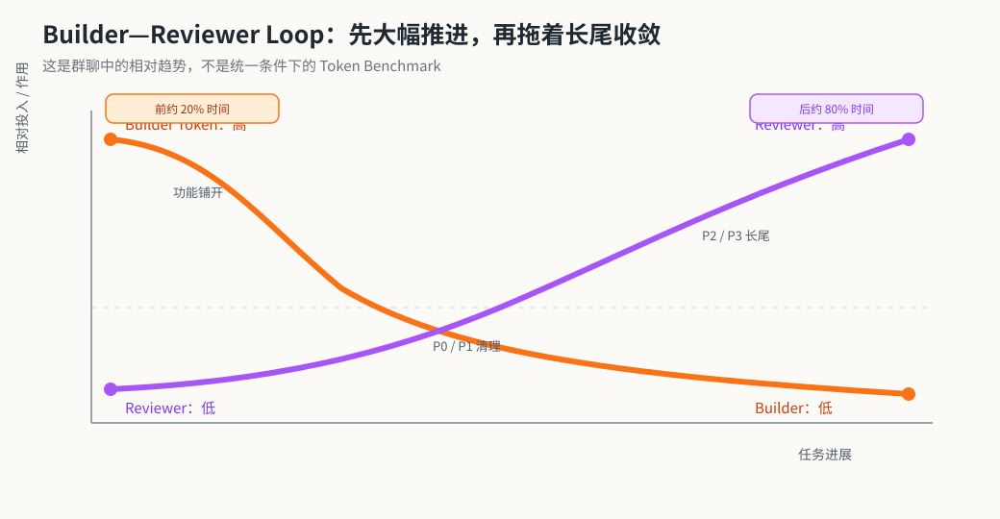

*图 4：前期 Builder 消耗更多 Token 铺开功能，后期 Reviewer 的相对作用上升，系统进入 P2/P3 长尾。*

4 月 14 日，我们真的沿着 PID 的类比改了一版 Humanize。[PR #81](https://github.com/PolyArch/humanize/pull/81) 把累计 Commit 和最近三轮 Summary、Review 一起提供给 Reviewer。对应提交把 Goal Tracker 与 Acceptance Criteria 的差值看作 P，把历史轨迹看作 I，把当前 Round 的变化看作 D。到 6 月复盘时，大家又给 P、I、D 重新分配过角色，甚至认为 Humanize 缺少的 D 恰好对应 `/goal` 的 Progressive Planning。这个映射一直在变，所以我更愿意把 PID 看成社区理解问题的一种工程语言。它帮我们看见震荡、积分记忆、阻尼和收敛速度，也没有把一个概率系统假装成精确的控制器。

长尾也说明了 Humanize 1.0 的适用边界。目标清楚、Plan 足够完整、验收条件可以写出来时，RLCR 很强；它会忠实地把自然语言 Plan 翻译成代码，再用独立 Review 把结果慢慢压到目标附近。探索型任务、快速小改和途中需要频繁改方向的任务，会让这套固定结构显得很重。到了 5 月 21 日，刘思皓给出的日常做法已经很朴素：当 Reviewer 剩下的全是 P2，就由人直接终止。控制系统最后仍然需要一个知道什么时候值得停下的人。

### 1.17：给固定 RLCR 画一个句号

4 月 21 日，群里第一次明确说，`1.17.x` 会成为 Humanize 1.0 的最后一条版本线。4 月 30 日，[1.16 合并 PR](https://github.com/PolyArch/humanize/pull/51)进入 `main`；这也是公开主线最后一个清楚的 H1 里程碑。5 月 1 日，`dev` 分支又出现了 [1.17.0 的版本提交](https://github.com/PolyArch/humanize/commit/f4e5721e344ef602a77cfb3511ec51b74e387120)，随后没有形成独立 Tag 或 Release，也没有进入 `main`。本书因此把 1.17 视作 H1 的开发线收官标记，同时保留 1.16 才是公开主线最后明确合并版本这项注释。

这个句号并没有否定 H1。它已经验证了一件很重要的事：Builder 和独立 Reviewer 可以构成一个有效的反馈循环，Goal Tracker、历史轨迹和 Stop Hook 能让长程 Coding Task 持续推进。我们后来才把这种结构概括成 Loop Engine。接下来的问题变了。模型更新得越来越快，Coding CLI 也越来越多，一条 Flow 继续硬编码 Claude Build、Codex Review，维护成本会迅速上升；同一个 RLCR 结构也覆盖不了探索、研究、批量维护、性能优化等差异很大的任务。

H2 最早的设想其实很直接：让用户自己选择模型，再把不同模型放进 Builder 和 Reviewer。这个想法很快牵出更深的一层——如果模型可以换，Flow 为什么还要和某个 CLI 绑死？

### 一个多月里，模型和工具一起换挡

回头看 4 月到 5 月，这个问题几乎是被发布节奏推到我们面前的。

4 月 7 日，[GLM-5.1](https://docs.z.ai/guides/llm/glm-5.1)把长程 Agentic Coding 放在核心位置，官方给出的单任务持续运行上限达到 8 小时。4 月 16 日，[Claude Opus 4.7](https://www.anthropic.com/news/claude-opus-4-7)发布，群里几分钟后就把它挂上 Humanize 测试。反馈并不整齐：有人觉得它写出来的代码更好看，也有人嫌它消耗额度太快；“Claude 适合早期铺开，Codex 更会修 Bug、做 Review”仍是当时很有代表性的一种分工。

4 月 21—22 日，群里开始传看 [Kimi K2.6](https://www.kimi.com/blog/kimi-k2-6) 的长程编码与 Agent Swarm 材料。它的[开放权重](https://huggingface.co/moonshotai/Kimi-K2.6)让“国产模型能不能平替”从价格讨论进入了 Builder 和 Reviewer 的实测。这里很快也出现分歧：有人认为 Kimi 的 Review 已经接近 GPT，也有人觉得它和 Opus、Codex 仍有明显差距。4 月 23 日，[GPT-5.5](https://openai.com/index/introducing-gpt-5-5/)进入 ChatGPT 与 Codex，群里几乎立刻把它放到 RLCR Reviewer 的位置。4 月 24 日，[DeepSeek V4](https://api-docs.deepseek.com/news/news260424/)又带来 Pro 与 Flash 两档模型、1M Context、开放权重，以及对 OpenAI 与 Anthropic API 的兼容。

这些节点挤在三周之内。具体 Benchmark 可以争论，方向已经很清楚：

- 模型厂商开始用“能否连续规划、调用工具、修错并交付”描述 Coding 能力，单轮代码生成的占比在下降。

- 智力、速度与成本逐渐分档。Pro/Flash、不同 Effort、Fast Mode 让“便宜模型铺 Build，强模型做 Review”从群聊里的省钱技巧变成可长期设计的 Flow。

- Kimi 与 DeepSeek 同时推进开放权重，DeepSeek 还兼容两套主流 API；5 月重写的 [Kimi Code CLI](https://www.kimi.com/code/docs/en/kimi-code/whats-new.html)也直接提供 Multi-provider 和内置 Subagents。模型和 CLI 的替换门槛都在下降。

- 模型能力与 Harness 能力开始一起发布。厂商交付的单位逐渐从“一个更聪明的模型”扩大成“模型 + Runtime + 权限 + 持续执行 + 编排”。

这种变化给 H2 的模型无关设计提供了很现实的理由。今天写死的最佳模型组合，几周后就可能变成旧答案。真正值得稳定下来的，应当是任务如何被拆分、状态怎样传递、谁有权执行什么动作、结果由谁验证，以及失败以后走哪一条边。

### 把 Flow 从模型里抽出来

4 月 22 日，H2 被拆成三个暂定层次：`humz` 用来描述 Agentic Flow，`hcc` 将它编译成实际运行的脚本与 Harness，`hvm` 负责执行编译结果和用户输入。第二天的讨论又加入了 ISA、类型系统、编译器和 VM/Runtime。名字后来没有完整保留下来，这个分层表达了当时最重要的直觉：Flow 可以先成为一个独立的中间层，再去适配 Claude Code、Codex、OpenCode、Gemini、Kimi 或下一款还没发布的 CLI。更简练的“Flow IR”要到 6 月复盘时才出现，本章把它当作后见性的概括。

编译器的类比也从这里展开。我们希望把一条 Flow 中相对稳定的东西抽出来：节点、边、状态、输入输出、验收条件、并行关系、循环、分支、Review 和权限。自然语言仍然负责表达目标和那些难以形式化的判断；能够机械执行的部分尽量落到脚本与运行时里。这样可以少花 Token，也能减少同一条 Prompt 在不同 Round 里慢慢漂移。

如果把当时的设想压缩成一行，大概是：

`自然语言目标 → Flow 表示 → 静态检查与变换 → 后端适配 → Agent CLI 执行`

这条链路有一点像编译器 IR。它可以检查某个 State 是否永远到不了、某条路径有没有出口、某个 Agent 是否缺少必要输入，也可以把不同后端的调用方式放到 Codegen 一侧处理。类比的边界也很清楚：Agent 的一次执行仍然带有概率，Verifier 的判断也会错。这里追求的是 Flow 结构更稳定、结果更容易观察，编译器本身的确定性无法原样复制过来。

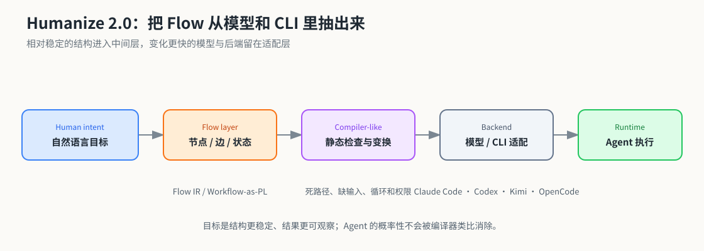

*图 5：H2 的核心直觉是让 Flow 成为独立中间层，再把模型和 CLI 放到后端适配层。*

当时还有一句我很喜欢的定义：

> Agent = Model × Tool × Action × Permission

Model 和 Tool 只解释了 Agent 能理解什么、能调用什么。Action 与 Permission 决定它此刻可以做什么：能否修改代码、启动子 Agent、访问网络、绕过 Sandbox、改变 Plan、更新 Goal，或要求人类确认。Flow 由此获得了安全和组织上的含义。两套 Agent 即使使用同一个模型，只要动作集合与权限边界不同，实际行为就可能完全不同。

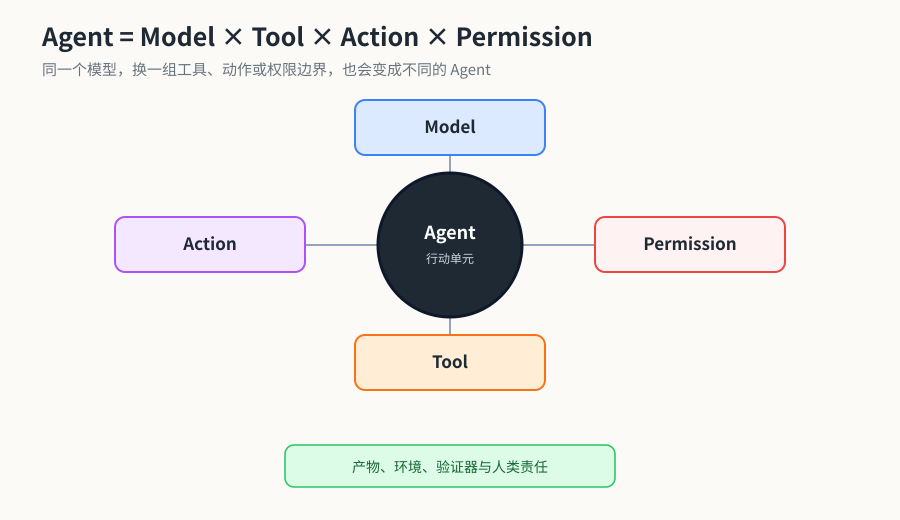

*图 6：Model、Tool、Action 和 Permission 共同决定一个 Agent 在具体环境中的行为。*

群里当时使用的原词是 `hvm` 或 VM/Runtime，“Agent VM”是本书为了阅读方便采用的简称。这个 VM 没有性能压力，一条“指令”可能运行几分钟甚至几个小时；它更像一台 Flow 执行和监控机，负责把状态交给下一节点，记录发生过什么，并在边界上执行权限和检查。

群里对这套构想始终有质疑。有人直接问：已有编程语言加 Agent SDK 已经能做编排，为什么还要造 DSL？刘思皓当时的回答很克制，Workflow-as-PL 首先是一套思维模型，实现时完全可以使用现成语言。这句话让讨论降了一点温。H2 从起点就背着一个问题：我们究竟需要一门新语言，还是只需要把少数可靠的 Flow 原语整理出来？

事实上，[5 月 17 日进入 `h2-dev` 的 PoC](https://github.com/PolyArch/humanize/commit/3fccb60c11332fb322a295db0583432416c7cf07) 已经换了一种形态：TypeScript、MCP Server Hub、HTML Workflow Runtime、Dashboard，以及把 RLCR、gen-idea、gen-plan 等能力重新表达成 Workflow Cartridges；最初真正接通的 Agent Backend 只有 Codex 和 Claude。它和最初聊到的 Rust、MLIR 方言与小型 VM 有很大差别。作者在公开分支时也反复提醒，这个版本用于开发一个更合理的 Agentic Flow Platform，普通项目继续使用 H1；仓库把它标成 Transitional Branch，包版本也只有 `0.1.0`。H2 当时是一份 First-step Proof of Concept。

我很喜欢这段不整齐的历史。大家先想换模型，接着讨论 IR、类型、编译器和 VM，最后落下来的 PoC 又采用了另一套基础设施。概念与实现互相试探，任何一版都还谈不上最终答案。H2 真正完成的转向，是让 Flow 本身第一次成为开发对象：人可以构造它、运行它、检查它，也可以拿不同模型与工具去替换其中的节点。

### `/goal` 带来的第二次震动

就在 H2 快速成形时，Codex 从另一个方向给出了答案。[Codex CLI 0.128.0](https://github.com/openai/codex/releases/tag/rust-v0.128.0)于 4 月 30 日 UTC 发布，北京时间已经进入 5 月 1 日。它加入了持久化 `/goal`：Goal 可以跨 Turn 保存，Core Runtime 在 Session 空闲时自动继续工作，模型拥有读取和更新 Goal 的工具，TUI 则提供创建、暂停、恢复和清除。

这很像把原先依赖 Stop Hook 维持的 Loop 收进 Codex 自己的 Runtime。首发时它仍然是实验功能，需要经 `/experimental` 开启。证据能确认的是 Codex 产品层内置了持续目标与自动续跑；它是否已经进入 GPT-5.5 的模型权重，需要另一套训练与评测证据。

群里的第一反应相当兴奋。5 月 6 日，有成员觉得 `/goal` “神奇地把 Build、Test、Review 结合在一起”，Build 的同时就在检查，阶段之间少了 Humanize 那种清晰、也略显机械的切换。直接把 Humanize 生成的 Plan 喂给 `/goal`，一度成了很顺手的组合。

真实体验很快又把判断拉回地面。有人发现 `/goal` 会改写自己的 Plan，遇到难点时绕路，或用很弱的完成判断给任务打勾；也有人用它连续完成了很大的从零构建。到了 5 月 26 日，群里出现了一组很有解释力的对照：

- Humanize：强 Review + Static Planning；

- Codex `/goal`：弱 Review + Dynamic Progressive Planning。

前者很稳，长尾明显；后者推进快，也更容易在途中自行改变路径。大家当时真正想要的答案，逐渐变成 **Dynamic Progressive Planning + Strong Review**。H1 的独立审查和 `/goal` 的动态推进各自抓住了一半。所谓 Harness 被 built-in，也呈现出更细的层次：内置能力会减少外部脚手架，却未必一次覆盖所有真实任务。

### 当同一个方向出现在厂商产品里

5 月 28 日，Anthropic 随 [Claude Opus 4.8](https://www.anthropic.com/news/claude-opus-4-8)在 Claude Code `v2.1.154` 中推出 [Dynamic Workflows](https://claude.com/blog/introducing-dynamic-workflows-in-claude-code)。群聊和后来的记忆里曾出现 `ultrawork`、“Auto Work”和“Auto Code”等名字，正式名称都应勘误为 **Dynamic Workflows**。Auto Mode 是建议搭配的权限模式，`ultracode` 则是 `xhigh` Effort 加自动 Workflow Orchestration 的设置。

官方描述里，Claude 会动态写出 JavaScript 编排脚本，把任务分给数十到数百个并行 Subagents，再安排独立 Agent 验证结果。5 月 28 日首发时它属于 Research Preview，后续才更新为 Generally Available。北京时间 5 月 29 日，群里的第一反应近乎错愕：有人问 `ultrawork` 是否已经覆盖 H2，Dynamic Workflows 是否又覆盖了 H3；也有人只说了一句，“最怕的就是大家都太快了。”

5 月 30 日，群里已经有人判断 H2 的独立空间被压缩了：与其另起一套平台，也许可以直接在原生 Workflow 的节点里接入 `codex-review` 或 `codex-rescue`。到 6 月 2 日，大家又修正了最初的理解。这里的“动态”主要指 Claude 按当前任务即时生成脚本；脚本生成后仍交给独立 Runtime 执行。H3 继续追问运行中的 Flow 能否被 Agent 改写，两者之间还隔着一步。

把这两份时间线并排放着看，很容易让人兴奋，到这里也得踩一下刹车。公开证据只能支持“同一个方向在接近的时间出现”，还不足以建立 Anthropic 与 Humanize 之间的直接影响关系。更稳妥的解释是，模型、CLI 和社区 Harness 都撞上了同一批工程问题：怎样让长任务持续，怎样并行，怎样验证，以及怎样在任务途中重写原有计划。

我现在再看 H2，最想留下的是那次视角变化。大家暂时放下“哪个模型更强”，开始追问“怎样描述一个生成软件的过程”。相近的能力很快出现在 `/goal` 和 Dynamic Workflows 中，一些 H2 实现后来被推翻，外部 Harness 仍要处理强 Review、权限、可观测、恢复、人类接管，以及 Flow 在运行中怎样变化。

当 Flow 终于可以被当成程序，下一步自然会有人问：这份程序一定要由人预先写好吗？这就把故事推向了 Humanize 3。

> 本章的群聊行号、版本状态与外部资料快照，见[第二章一手资料核查](materials/research/02_第二章_Humanize2_一手资料核查.md)和[第二章参考资料卡](materials/references/02_第二章/README.md)。

## 第三章｜让人跟上 Agent

第二章把故事停在 Flow 的程序化和厂商的 Dynamic Workflows。要理解 H3 为什么会出现，时间还得往回拨一点。H2 的 PoC 尚未公开时，一个更让人不安的问题已经先冒了出来。

5 月 9 日，群里有人谈起自己的真实感受：把代码库完全交给 AI，最后很难对它负责；每一步都跟下来，心智压力又大得受不了。刘思皓当时正在做 H2，也遇到了同样的两难。他把问题写得很直接：一套超过 H1 十倍规模的系统，怎样保证人类知情？如果有一天 AI 工具全部失效，造出这个系统的人还能不能手动修掉一个 Bug？

这几句话后来成了 H2 和 H3 之间一条很重要的暗线。Agent 可以持续运行，也可以继续增加并发，人的理解速度却没有随 Token 一起增长。生产力涨到一百倍，人类的掌控度很可能停在原地。

### 人类先掉出了循环

回看这段群聊，我愿意把它称为 **Human Awareness 与 Cognitive Load 问题**。这里需要保留一点史料上的克制：`Human Awareness Cognitive Load` 并没有作为完整术语出现在当时的对话里。5 月的原话是“保证人类知情”和“人类掌控度”；到了 6 月 18 日，群里又在长程任务的讨论中说，这“其实还是一个 `cognition overload` 的问题”。两组表达前后呼应，本书将它们合在一起，作为方便回顾的标签。

H1 的反馈主要朝向产出。Builder 写代码，Reviewer 查错，测试和 Goal Tracker 提供状态，下一轮据此修正。人虽然留在系统外面，却可以把一个相对清楚的目标交给 Loop，最后回来验收。Agent 数量变多、任务周期拉长以后，这套关系开始松动。系统内部每天产生大量设计决定、分支、实验和失败，最终结果即使通过了测试，人也可能已经说不清它为什么长成这样。

于是，Review 的对象需要扩大。代码有没有完成仍然要查，Flow 还要照顾使用者的认知状态：当前走到了哪里，哪些决定已经发生，哪些风险仍然存在，接下来的人类判断会影响哪一条路径。Agent 在这里多了一项很少被写进 Benchmark 的工作——把自己的推进过程压缩成人能跟上的节奏。

这个问题和 Observability 有关，却比“把日志展示出来”更麻烦。完整 Trace 只会把机器的 Context 压力转移成人类的阅读压力。群里当时甚至把边界设得很极端：假设全世界的 AI 明天都消失，留下来的工程师还应当有能力继续维护这个系统。这个假设未必真的发生，却能逼着我们判断哪些知识必须留在人脑和工程产物里，哪些细节可以放心交给自动化。

### Human Harness：带着人类往前跑

5 月 12 日，讨论从“人怎样保持知情”落到了一个很朴素的办法：**抽样层级考试**。

这个名字听起来很像“小镇做题家”，群里也确实这样自嘲过。它解决的却是一个很实际的带宽问题。人没有能力复核 Agent 决策树里的每个节点，Flow 可以先挑出依赖关系最重、风险最高、最需要人类判断的部分，在进入下一层之前确认人是否理解。编译、测试和其他机械验证能够挡住的问题，不必再拿来消耗人的注意力。

同一天，群里出现了两句话：

> agent harness 让 AI 更强大；human harness 让人类更负责。

“Human Harness”这个名字由此出现。它的方向很有 Humanize 的味道：Harness 继续约束 Agent，也开始安排人类怎样介入、在什么地方介入，以及介入前需要知道什么。刘思皓后来用了一个更形象的说法——“带着人类往前跑”。群里还把这种关系从 CAD 延伸成 HAD，也就是从 Computer Aided Design 走向 Human Aided Design：Agent 组织生产过程，人把有限的脑力留给 Flow 精心挑出的确认点。

当时设计了三类检查：

1. **记忆**：让人复述自己已经做过的设计，检查设计意图是否发生了漂移；
2. **自检**：让人审视 Agent 给出的方案，确认 AI 是否理解错了需求；
3. **教育**：补充继续做决定所需的背景知识，避免人在没理解关键概念时直接放行。

这套机制很快被称为“教练模式”或 Coach Mode。我当时更想要的是 `Plan-time Human Verification`，也有人使用 `Interactive Plan Comprehension Gate` 来描述它。关键点在 `Plan-time`：检查发生在 Plan 逐层展开的过程中。人和 Agent 对当前设计达成一致，下一层才继续生成；等完整 Plan 写完再问一句“是否确认”，已经太晚了。

我在 5 月 13 日把这个想法提交成了 [Humanize PR #159](https://github.com/PolyArch/humanize/pull/159)。它后来以 `gen-plan --coach` 的形式于 6 月 13 日合入 `dev`：First-pass Analysis、Candidate Plan、每轮 Convergence 和最后定稿之间，都设置理解检查；回答对不上时，系统分别处理成设计意图漂移、AI 设计修正或背景知识缺口。最终 Plan 写入之前，还要做一次整体接受。

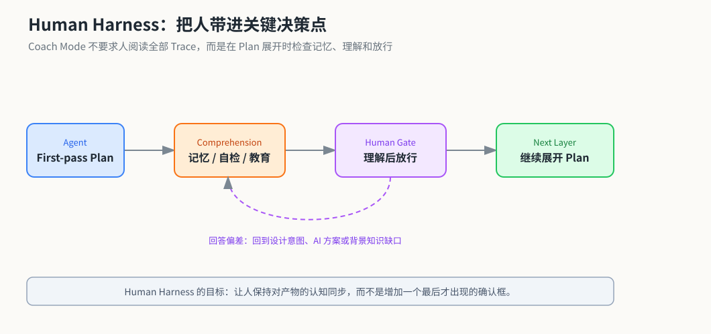

*图 7：Coach Mode 把人类理解检查放进 Plan 展开的过程，而不是只在最后弹出确认框。*

这段实现史值得把两个时间点分开记。5 月 13 日出现的是 idea 和 PR，6 月 13 日才完成代码合入。Coach Mode 也一直是可选项。它展示了一种具体做法，还没有成为所有 Agent 开发都必须遵守的标准答案。

### 三代 Humanize 第一次被放在一起

5 月 16 日，H2 的公开 PoC 已经接近完成。刘思皓在群里第一次把三代 Humanize 连在一起：

> h1: A flow that works
> h2: A platform/language that human build/test flow
> h3: An automation system that let agents builds its own flow

原文带着群聊里很自然的语法和缩写。整理成较通顺的英文，可以写成：

| 阶段 | Roadmap 表述 | 当时要回答的问题 |
| --- | --- | --- |
| Humanize 1.0 | **A flow that works.** | 一条 Builder—Reviewer 的 RLCR 能否在真实工程中持续工作？ |
| Humanize 2.0 | **A platform/language where humans build and test flows.** | 人能否描述、组合、运行并验证不同的 Flow？ |
| Humanize 3.0 | **An automation system where agents build and evolve their own flows.** | Agent 能否生成 Flow，并在执行过程中修改它？ |

第二天，[H2 PoC](https://github.com/PolyArch/humanize/commit/3fccb60c11332fb322a295db0583432416c7cf07) 被推到 `h2-dev`。这个版本提供 Flow 原语、HTML Workflow Runtime、触发式数据流执行器、MCP Hub、Agent Backend 和 Dashboard。作者反复提醒大家，它是用于共同研究 Flow Platform 的 First-step PoC，普通项目仍应继续使用 H1。

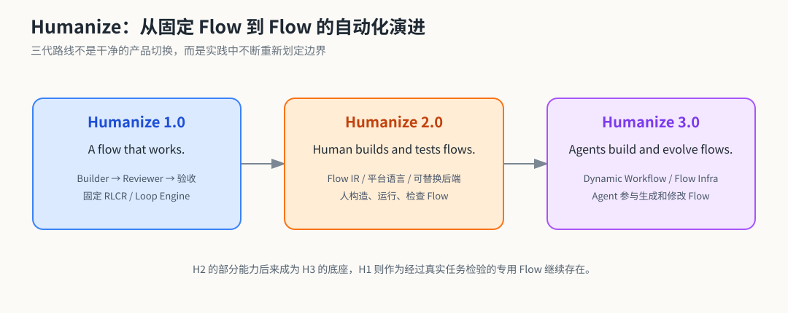

*图 8：三代 Humanize 的路线是从固定 Flow、到人构建 Flow、再到 Agent 参与构造和演进 Flow。*

到 6 月 16 日，群里又给三代路线补了一版更接近实现的解释：H1 是单一、硬编码的 RLCR；H2 是构建 Flow、允许 Flow 调用 Flow 的 IR；H3 是让 Flow 生成 Flow 的平台。这里的 “Flow IR” 带有回顾性质，却比早期 `humz / hcc / hvm` 的命名更容易抓住重点。三代之间也没有干净的产品边界。H2 的部分能力后来直接成为 H3 的底座，H1 则继续作为一个经过真实任务检验的专用 Flow 存活下来。

### 从 HTML PoC 转向 Oh My Pi

这条路线中还有一个很容易写错的项目名。群里使用的是 **Oh My Pi**，缩写 **OMP**。

[Pi](https://github.com/earendil-works/pi) 是 Mario Zechner 开发的轻量 Agent Toolkit，提供模型调用、Agent Loop、工具和终端交互等基础部件。[Oh My Pi](https://github.com/can1357/oh-my-pi) 在 Pi 上继续扩展 Coding Harness。5 月 22 日，我在群里强烈推荐大家试试 OMP。到了 5 月 28 日，刘思皓的反应非常直接：`omp is soooooo good`，接着说 `I need to build h2 on omp`。

他此前花了很多时间给 H2 对接模型供应商、CLI 和运行设施。OMP 已经把这些地基搭好，Humanize 可以把精力放回 Flow 本身。这里的实现顺序要讲清楚：5 月 17 日的 H2 PoC 先采用了 TypeScript、HTML Runtime 和 MCP Hub；它当时没有“接入 OmniPi”。OMP 路线随后出现，H2/H3 的相关能力从 6 月开始在 `oh-my-humanize` 中重新实现。

[oh-my-humanize](https://github.com/humanfia/oh-my-humanize) 最初建在 `PolyArch` 组织下，是 OMP 的一个增量 Fork。仓库在 6 月 1 日 UTC（北京时间 6 月 2 日）加入 Workflow 定义、条件与运行时，随后数小时已经有运行中的 Graph Revision 调度；6 月 12 日又集中落地 Mutable Workflow Runtime。6 月 19 日 UTC（北京时间 6 月 20 日），由于 Fork Network 无法直接分离，项目迁移到 `humanfia/oh-my-humanize`。今天回看两个仓库地址，它们属于同一条迁移历史。

这次转向也修正了 H2 PoC 里一部分过度设计。6 月 16 日，群里很坦率地反思拿 HTML 当 Flow Language 的做法，新的实现改用 YAML 表达解开的 AST，把机械流程直接交给 JavaScript 或 TypeScript。代码越来越便宜以后，专门 DSL 的维护成本反而显得更重。Flow 需要稳定表达，表达方式可以务实一点。

### Dynamic Workflow 的三层含义

5 月 28 日，Anthropic 在 Claude Code `v2.1.154` 中正式发布 [Dynamic Workflows](https://claude.com/blog/introducing-dynamic-workflows-in-claude-code)。首发时它属于 Research Preview。Claude 可以根据任务动态编写 JavaScript 编排脚本，把工作分给数十到数百个 Subagents，并在结果汇总前安排独立验证。

这个发布给社区带来的第一反应是：H2 或 H3 会不会刚刚出现就被厂商覆盖？几天后的讨论逐渐把“动态”拆成了三个层次：

1. **静态流程**：人在运行前写好图、条件和检查，Agent 按固定结构执行；
2. **动态生成或选择流程**：Agent 根据当前任务生成脚本，或从已有 Flow 中挑选组合；这次运行仍然会落成一份具体结构；
3. **运行中自我修改流程**：Agent 或人根据中间结果修改正在运行的图，后续节点使用新的 Revision。

社区当时把 Anthropic 的方案放在第二层，把 H3 的实验放在第三层。这个分类属于 Humanize 社区的工程理解，并非 Anthropic 的官方定义。两者也没有可证明的直接影响关系。它们只是非常接近地撞上了同一个问题：任务启动前写下来的 Workflow，很可能无法预见长程执行中出现的全部信息。

6 月 2 日，H3 被概括成 `agent mutable workflows`。早期设计里，Agent 可以提出修改，但真正改 Flow 需要人类批准；实验模式也允许放开这个 Gate。刘思皓同时连续问了三个问题：谁来设计和修改 Workflow？怎样修改才合理、合法？什么时机应该触发修改？他给出的答案也很诚实：“我不知道。”先把接口和基础设施搭出来，再用大量真实任务找方法。

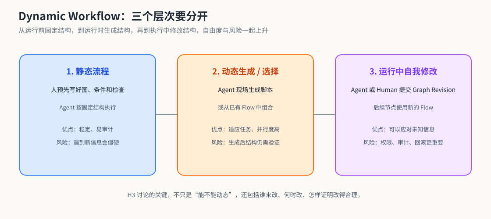

*图 9：静态流程、动态生成或选择流程、运行中自我修改流程的自由度和控制风险逐层上升。*

这份“不知道”很重要。运行中修改听起来天然比静态图灵活，也天然带来新的失控面：Agent 可能删掉不喜欢的检查，降低目标，绕过难点，或者为了通过评测而 Reward Hack。H3 从一开始就带着怀疑。它要验证的是这种自由度能否产生收益，以及人类批准、变更审计、Checkpoint 和外部 Review 能否守住边界。

### Monitor Loop：让 Human 只在需要时回来

H3 还在讨论怎样修改 Flow 时，社区先拼出了一套很实用的外挂方案。6 月 6 日，刘思皓把一条正在运行的 Codex `/goal` Session ID 交给另一个 Claude Code Session，再让 Claude 用 `/loop 1h` 定时读取代码库和完整 Transcript。群里后来把这种做法叫作 **Monitor Loop**。

这里和我最初的记忆有一点差别。典型组合里，Codex `/goal` 负责长程执行，Claude Code `/loop` 负责监控。群里也有人用一个 Codex `/goal` 去盯另一个 `/goal`，随即有人担心同一种模型会沿着相同的错误路径走下去。把 Worker 和 Monitor 分开，恰好能提供一个相关性稍低的外部视角。

Monitor 看的范围比普通 Code Review 更高一层。它会判断当前工作是否还在主线上，连续几个小时深挖某个细节有没有推进 Goal，结果里是否混入了伪造数据或 Stub，以及 Transcript 中已经明确的约束有没有被遗忘。当时群里描述最多的一类跑偏，其实是“钻牛角尖，深挖细节，不推进主线”。实现未必写错了，时间却花在了低效路径上。

这套方法还有一个很有意思的说法：让 Monitor “感受时间流逝的痛苦”。Worker 的 Context 会不断压缩，它很难判断自己已经在同一个方向上耗了多久；独立 Monitor 每隔一小时回来一次，天然拥有几个真实的时间刻度。它可以允许 Worker 做三小时的基础探索，到了第五个小时仍没有进展，再提醒人可能不对劲了。

发现问题以后，Monitor 先拟一段 Steer Prompt，通过 Remote Control 把提醒发到手机。需要改变方向、策略或优先级时，人仍要审核；批准以后，Claude 再通过 tmux 把 Prompt 注入正在运行的 Codex TUI。到了 6 月 8 日，实践中又加入了少量 Auto-inject 白名单。6 月 17 日公开的 Skill 随后把边界写得更清楚：重复人类已经确认过的原则，或者拦截明显的完整性问题，可以自动处理；新的判断继续交给人。

这套组合很快改变了值守方式。此前人肉同时盯三条 `/goal` 已经让人疲惫，接入外部监工后，群里有人自报可以在手机上看十条 Monitor Loop。这个数字只是个人实践记录，却把收益说得很清楚：高频、机械的检查交给另一个 Agent，人从固定 Check Point 退到异常处理和方向决策的位置。

6 月 10 日，群聊里正式出现了 `Monitor Loop` 这个名字；6 月 17 日，[`monitor-codex-goal` Skill](https://github.com/SihaoLiu/skills/tree/ec9cd9e2733f28d93bbf66c37ef58722cf6390ce/monitor-codex-goal)公开，把只读审计、手机通知、人工审批和受控注入写成了一套完整规则。刘思皓当时把它叫作 “Humanize 2.7”。我觉得这个叫法很准确：它还没有走到 H3 的动态 Workflow，却已经把 Human Harness 放进了一条真实运行的长程任务里。

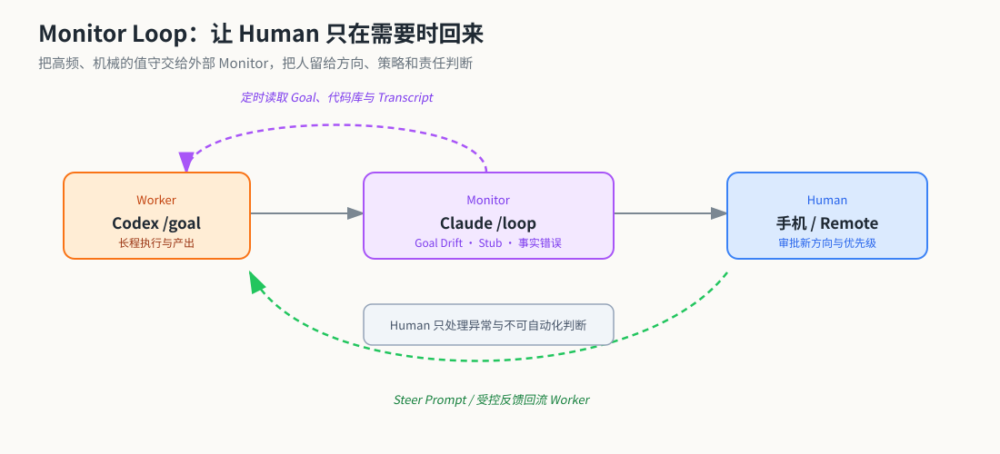

*图 10：Worker 负责持续执行，Monitor 负责发现偏航，Human 只处理方向、策略和责任判断。*

### 从热修改走向受控演化

代码很快给这份怀疑做了一次工程校正。6 月 12 日的 Mutable Runtime 还允许调度器读取新的 Graph Revision；到了 6 月 13 日，[仓库已经拒绝直接修改正在运行的 Flow](https://github.com/PolyArch/oh-my-humanize/commit/eb78a8eacc905434dd340f01a0f1ea8fa5d90276)，要求先提交 Workflow Change Request。次日的文档又把生产语义写得更明确：一次运行绑定不可变的 Freeze；确实需要改 Flow 时，操作员要先停止运行、保存 Checkpoint、批准变更、冻结新的图，再从 Checkpoint 重启。

H3 由此从热修改走向了受控演化。Agent 仍然可以参与创造和修订 Flow，正在工作的系统却不会在无人知情时悄悄变形。这个来回很值得写进历史。它比一句“运行中自我修改”更接近真实工程，也把 Human Harness 重新带了回来：每次改变结构，都要让人知道改了什么、为什么改，以及该从哪里接着走。

### 九种 Flow 上线，又被撤回

6 月中旬，H3 进入了密集的原型化阶段。6 月 13 日，作者仍在本地同时跑几十个 Loop，认为长程工具需要用更长的运行时间来测试；6 月 15 日，`oh-my-humanize` 到了愿意公开请社区一起试用的程度。当时仓库里短暂内置了九种 Flow，其中包括 Humanize 1.0 的 RLCR 和 KDA。

两天后的情况很能说明真实的 Agent 工程是什么样子。作者发现其中一两个 Flow 似乎有 Bug，于是把整批 built-in 一起撤回；[仓库提交](https://github.com/PolyArch/oh-my-humanize/commit/21e56a0892beeffdab258157860ec9d94f25e378)也将未充分验证的 Flow 降级。6 月 18 日，他在群里说，自己要先在本地连续运行 80 小时，确定没有问题，才会重新升格为内置 Flow；RLCR 与 KDA 当时仍被认为可用。

所以，“九种内置 Flow”只存在于一小段公开试用窗口，不能用今天的 README 倒推成一个稳定版本。80 小时也只是当时设置的工程门槛，还谈不上成熟 Benchmark。它却留下了一个很好的教训：Flow 可以由 Agent 快速生产，升格为社区默认能力仍需要慢得多的验证。Agent 能写 Flow 以后，验证 Flow 很快成了新的瓶颈。

KDA 是这一阶段最有说服力的例子。[Kernel Design Agents](https://github.com/mit-han-lab/kernel-design-agents) 把 Humanize 的 Plan 与 RLCR 用在 CUDA Kernel 研究、实现、正确性验证和性能迭代中，并结合 KernelWiki 与 Nsight Compute 报告 Skill。公开的 [MLSys 2026 FlashInfer Contest 复现仓库](https://github.com/mit-han-lab/mlsys2026-flashinfer-contest)记录了 Full-Agent Approach 三条赛道的结果：MoE 第 1、DSA 第 2、GDN 第 3。OMH 里的 `kda-humanize` 又把 Humanize RLCR 作为 Subflow 调用，刚好展示了一个 H1 专用 Loop 怎样进入 H3 的 Flow Infra。

这里也需要做一处边界说明。群聊常把 KDA 与 NVIDIA Track、NVIDIA 工程背景成员的实践放在一起谈，公开仓库的归属是 MIT HAN Lab；“MLSys 2026 Competition NVIDIA Track”是竞赛赛道名称。更稳妥的说法是：它源于真实的 Kernel 优化实践，并通过公开竞赛结果给 Humanize Flow 提供了可复查的成绩。

### 当注意力重新回到 CLI 和模型

到了这个阶段，社区对 Humanize 的使用开始分化。6 月 12 日，刘思皓说自己仍会在两个场景使用 H1：`gen-plan`，以及 PR 级别的工作；另一类价值来自 KDA 这种魔改 Humanize 的专用 Flow。他把更多精力放到了 `oh-my-humanize`。H1 没有消失，它从日常默认入口收缩成了规划工具、高风险 Review Loop 和专用工作流的底层组件。

“龙虾”也要在这里单独勘误。聊天记录里的“龙虾”或“小龙虾”一贯指 [OpenClaw](https://github.com/openclaw/openclaw)，不指 Humanize。OpenClaw 作为 Coding Agent 的评鉴热度逐渐下降以后，大家反而重新发现它背后的 Pi 很适合做轻量 Agent Core。于是出现了一个有趣的反差：庞大的成品工具淡出讨论，底层更小、更容易定制的 Harness 又回到了中心。

模型发布则不断把大家拉回 Claude Code、Codex、Kimi Code 和各种 Pi Fork。6 月 13—14 日，群里已经开始提前传播和试用 GLM-5.2；有人觉得它能很自然地使用 Dynamic Workflow，也有人马上指出速度慢、容量紧和幻觉。智谱在 [6 月 16 日的正式公告](https://z.ai/blog/glm-5.2)中将 1M Context、长程 Agentic Work、Flexible Effort 和 MIT 开放权重放在核心位置。群聊先于正式发布日期出现，整理时应把它记作提前流传或灰度体验。

6 月 26 日，OpenAI 开启 [GPT-5.6](https://openai.com/index/previewing-gpt-5-6-sol/) 限量预览，分为 Sol、Terra 和 Luna。`max` 让单个 Agent 思考更久，`ultra` 则会使用 Subagent 推进复杂任务。消息进入群聊后，讨论很快从 Benchmark 转到 Token Efficiency、并行规模和长程任务中的 Reward Hacking。7 月 9 日，[GPT-5.6 全面发布](https://openai.com/index/gpt-5-6/)，自动拆分和多 Agent 协调正式成为厂商产品的一部分。群里后来出现数十乃至上百个 Subagent 的运行记录，那些是个人实验数据，不能写成产品保证的固定规模。

7 月 16 日，[Kimi K3](https://www.kimi.com/code/docs/en/kimi-code/whats-new.html)上线 Kimi Code、Agent 与 API，带来 2.8T 参数、原生视觉和 1M Context；完整权重在 7 月 27 日开放。群里的反应依旧很 Humanize：发布当天有人兴奋，也有人觉得前几代的宣传已经消耗了信任；几天后，长程 Build 和前端重构的实测开始改变一部分人的判断。有人提出 `K3 Build + Sol Review`，也有人继续认为 Sol 或 Fable 更强。它没有形成整齐的排名，却很快进入了 Builder、Reviewer、成本和速度的重新分工。

把这几个月连起来看，模型和 Harness 一直在交替往前走。社区先把 Loop、Review、Goal、Subagent 和 Flow 做成外部结构，厂商随后把其中一部分收进 CLI、Runtime 或模型行为；模型能力再向前一步，原来的 Harness 就暴露出新的摩擦，社区又转去做更高层的控制、验证和人类同步。

Humanize 3 在这条线上留下的核心问题很朴素：当 Agent 已经能够生成自己的工作流，人还能不能看懂它为什么这样安排，并在关键节点保持真实的决定权？Human Harness 和 Coach Mode 给出了一次早期回答，Mutable Workflow 则把下一轮实验的接口打开了。答案还会继续变化，人的认知带宽不会自动增长。Agent 越能长程运行，“让人跟上”就越像 Harness 必须承担的一部分。

> 本章的群聊行号、仓库提交与模型发布时间，见[第三章一手资料核查](materials/research/03_第三章_HumanHarness与H3_一手资料核查.md)和[第三章参考资料卡](materials/references/03_第三章/README.md)。

## 第四章｜Harness 成为一种方法

进入 7 月以后，我们谈论 Harness 时，指向的东西已经越来越宽。有人继续使用 Humanize 1.0，有人把工作交给 Codex `ultra`，有人用 Kimi Code，也有人回到只有 Bash 和 Subagent 的 Bare Pi。工具看起来走向了不同方向，大家真正反复调整的却是同一组关系：任务怎样拆，模型可以碰什么，状态放在哪里，结果由谁验证，以及人应该在什么时候回来。

这也是我想在这一章里留下的变化。Harness 最早是一套看得见的工程结构：Loop、Hook、权限、运行时、独立 Reviewer。到了这个阶段，它开始成为一种实践方法。一个人即使没有安装 Humanize，也可能在自己的 Plan、Review、Skill、脚本和交付规范里使用相同的思想。相反，安装了很复杂的框架，也不代表他已经解决了目标漂移、认知同步和责任边界。

### 模型把 Harness 收进了默认路径

7 月 9 日，[GPT-5.6 全面发布](https://openai.com/index/gpt-5-6/)。社区最强烈的感受来自两处。`max` 会给单个 Agent 更多推理、检查和修改的时间；`ultra` 默认协调四个 Agent 并行工作，在 API 中还对应一套 Multi-agent Beta。与此同时，Programmatic Tool Calling 允许模型现场写一段小程序，串联工具、处理中间结果，再决定下一步。

群里很快出现了一句很有感染力的判断：“模型把 Harness 内化了。”大家看到 GPT-5.6 自动规划任务、派出 Subagent、追踪进度，再用另一条路径做 Review，直观上已经很像 Humanize 早期的 Builder—Reviewer Loop。曾经要在外面写 Prompt、Stop Hook 和调度脚本的能力，正在进入厂商默认提供的产品路径。

这句话需要留一条事实边界。公开资料能够确认的是模型、System Prompt、Runtime 与产品界面共同呈现出的行为；外部没有证据把其中每一部分拆开，更无法仅凭一次运行判断某个 Workflow 已经写进模型权重。`max` 也不同于 `ultra`：前者增加单 Agent 的思考预算，后者才明确包含多 Agent 编排。本书沿用“内化”这个社区说法时，表达的是使用者看到的整体变化，不对训练细节作推断。

边界分清以后，真正的问题反而更有意思：当 Subagent、工具调用、流程规划和自我检查已经被模型与 Runtime 打包进默认入口，外部 Harness 还剩下什么价值？

### 国产模型坐上了同一张桌子

这个问题的热度，很大一部分来自国产模型的快速跟进。7 月 16 日，[Kimi K3](https://www.kimi.com/help/agent/agent-overview)进入 Kimi Code、Kimi Agent 与 API。官方公布的规模是 2.8T 参数，带原生视觉和 1M Context；完整权重在 7 月 27 日开放。同日更新的 Kimi Code 已经支持后台 Coder Subagent、Todo、Plan、Skills 和嵌套 Agent。开源模型、Coding CLI 与 Agent Runtime 开始作为一整套东西进入开发者手里。

群里的反应仍然很真实。发布当天既有兴奋，也有前几代体验留下的怀疑。随后几天，长程构建、前端重构和 Review 的实测慢慢增多。有人采用 `K3 Build + Sol Review`，有人把 K3 放进 Kimi Code，也有人放进 OpenCode 或 Pi。相同模型在不同入口里的表现并不一致，大家因此越来越少只问“模型排第几”，而会继续追问：它用了什么 System Prompt，开放了哪些工具，怎样管理 Context，任务结束前有没有独立验证。

7 月底还有一个很典型的实验：群友把 K3 放进 Bare Pi，只保留 Bash 与 Subagent，反而觉得效果更好、交互更省。大家开玩笑说“高级食材不需要高级烹饪”。这句话没有证明复杂 Harness 已经失效，它提醒我们另一件事：强模型可能更容易被过多工具、过长规则和频繁的中间往返拖住。删掉一个工具、缩短一段 Prompt、减少一个固定阶段，同样属于 Harness Engineering。

### 把设计、执行和审查拆成三个主 Session

7 月 18 日，群里先描述了一套很完整的角色化工作流。人类和 Arch 长时间讨论，把设计、决策和约束沉淀进“会议记录”；PM 只读取已经说清楚的切片，派往隔离的 Worktree，再负责汇总和合并；Audit 读取 PM 的 Session JSONL、代码变化和工作记录，找出被跳过或误判的部分，形成“会议缺陷”，再把问题带回人类和 Arch。每个主 Session 还可以带 3—10 个 Subagent，设计、实现和审查同时推进。

7 月 25 日，用户提供的这张图把这套实践画成了更具体的模型路由：Arch 保留设计权威，PM + `/goal` 负责调度，Reviewer 和 K3 Worker 分别承担检查与 Build，Contractor 处理临时急活，底部的 PM + `/goal` 再把结果收回下一轮任务。群里同期的经验是让 GPT 做设计、协调和审查，把 Claude、Kimi 和 GLM 放到 Build；这套按角色分工的做法后来被称为 `graph engineering`。这里的图示标签比聊天原文更具体：图中写作“工作审计.md”，原文更接近“会议缺陷”；“PM 的小弟 reviewer”也是对多层 Subagent 的可视化称呼。

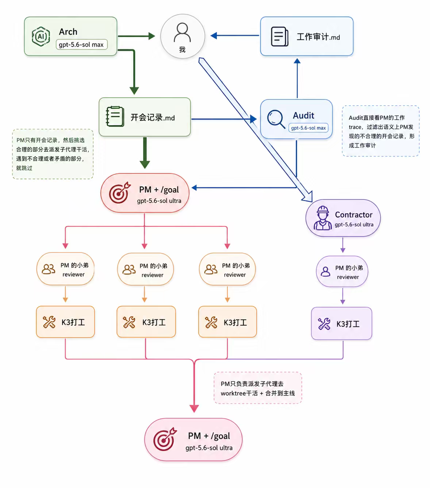

*图 12：用户提供的 2026 年 7 月 25 日流程图。对应的 Arch—PM—Audit 角色分工最早完整记录于 7 月 18 日，7 月 25 日又在模型路由和 `graph engineering` 的讨论中得到确认。详细行号和证据边界见[相关一手资料核查](materials/research/05_七月25日_ArchPMAudit与Subagent实践_一手资料核查.md)。*

7 月 31 日，[DeepSeek-V4-Flash-0731](https://huggingface.co/deepseek-ai/DeepSeek-V4-Flash-0731/blob/main/README.md)发布，官方称它取代此前的 Preview，在 Agent 能力上有明显提升。其 Model Card 给出的 Terminal-Bench 2.1、DeepSWE 等成绩已经与当时最强的闭源模型进入同一张比较表，部分项目仍有差距，因此本书把它描述为“广泛接近、可以正面竞争”，不写成全面领先。

这份 Model Card 还留下了一条比排名更重要的注释：Code Agent 项目使用了尚未公开的 **DeepSeek Harness minimal mode**，并开启 `max` 推理强度。一个主打模型能力的官方结果，依然依赖特定 Harness 才能成立。模型和 Harness 到这里已经很难拆开比较；我们测到的始终是模型、运行环境、工具、Prompt、预算和验证器组成的系统。

### “说好的不需要 Harness 呢”

强模型带来的第一轮兴奋，很快又被长程任务里的故障校正。7 月 24 日，一位群友让 Sol 持续推进一个复杂重构。它经历五次 Context Compaction，写出六千多行代码，期间还曾明确否决一条错误路线，最后却绕了一圈继续沿着那条路线实现。群里马上有人建议重新接上 Monitor 或 RLCR；随后冒出一句半开玩笑的感叹：“说好的不需要 Harness 的时代呢。”

这段经历很能说明 Humanize 1.0 为什么会被重新发现。模型可以自己规划，也可以在局部做得很聪明，长程执行仍然很难给出确定性保证。它可能忘掉早期约束，在 Compaction 后丢失 Subagent 的生命周期，或者用一套看起来完整的实现绕开真正困难的验收项。在 Autonomous Agent 场景里，任务越自主，错误被发现以前扩散的范围也越大。

H1 被重新发现，重点落在一组可以外置和反复执行的检查上：目标留在模型 Context 之外，Review 使用独立视角，验收项逐条寻找证据，连续失败触发停止，最终产物留下可以追溯的轨迹。对于需求清楚、强约束很多、失败代价高的任务，这些机械结构依旧有效。[KDA](https://github.com/mit-han-lab/kernel-design-agents)一类垂直 Flow 也提供了具体样例：通用模型配上领域里的验证器、性能指标和专用知识，往往比单纯增加思考时间更可靠。

DeepSeek 的官方评测使用 Minimal Harness，也从另一个方向印证了这件事。模型越强，Harness 未必越厚；可靠性要求越高，外部约束越难完全消失。它可能变薄，可能藏进 Runtime，可能只留下几个关键 Check Point，但总要有人明确什么叫完成、怎样证明完成，以及失败以后由谁接手。

### 框架变薄，方法留下

到了这时，我越来越愿意把 Harness 理解成一组工程选择，而不把它等同于某个框架的体积。

[Claude Code 的权限规则](https://code.claude.com/docs/en/permissions)决定 Agent 能读写什么、哪些动作需要批准；[Hooks](https://code.claude.com/docs/en/hooks)把测试、审计和外部动作放到确定的生命周期节点；[Subagents](https://code.claude.com/docs/en/sub-agents)提供独立 Context、工具白名单和角色隔离。Codex 用 `AGENTS.md`、Sandbox、Approval 与多 Agent 接口表达相近的边界。[Pi](https://github.com/earendil-works/pi/blob/main/packages/coding-agent/docs/extensions.md)则把核心做得很小，允许用户从无内置工具的状态开始，再用 Extension 动态加入真正需要的能力。

这些工具的外形差异很大，背后的问题高度相似：

- 哪些任务适合交给模型自由探索，哪些步骤应该写成确定脚本；
- 哪些工具可以常开，哪些动作需要显式授权；
- 什么状态必须落到文件、Git、Issue 或 Artifact，不能只留在 Context；
- 哪个结果可以由同一个 Agent 自检，哪里必须引入独立 Review；
- 哪些异常可以自动纠偏，什么时候必须停止并叫人回来。

一个只有 Bash 和 Subagent 的 Pi 配置，也是一套 Harness。它已经对工具面、并行方式和信息流作了选择。社区后期对 Humanize 的一个很有意思的评价是：很多人会先看懂其中的 idea，再把适合自己的部分重新写进工作流。框架可以被替换，方法会沿着 Skill、Prompt、Hook、测试和团队规范继续流动。

### 动态主义与组合主义

8 月初，社区又把 6 月讨论过的两条路线拿出来重看。Codex `ultra` 更接近在线生成：模型根据眼前任务决定如何拆分和派发，执行中继续调整。Claude Code Dynamic Workflows 会先生成一段可执行的编排脚本，再由 Runtime 按阶段、并行与循环运行。Humanize 1.0 则代表一条已经被实践验证的固定 Flow。

群里把前两种倾向分别叫作“动态主义”和“组合主义”。机械维护、批量迁移、可重复验证的垂直任务，更适合把 Flow 写成代码，降低每一轮现场决策带来的漂移。探索、研究和持续出现新信息的任务，需要给模型更多在线判断空间；提前写死的图很难预见过程中冒出的关键问题。

两条路线都有自己的失败方式。固定 Flow 会僵硬，把已经不需要的步骤继续执行；动态 Flow 可能少派、乱派或过度派发 Subagent，也可能在任务后半段自行改变标准。社区没有得出统一冠军，最后留下的一句判断反而很朴素：脱离具体任务争论哪种方法更好，意义不大，关键还在人。

这句话把 Harness 从架构问题带回了方法论。真正成熟的使用方式，可能是人在两种模式之间主动切换：对已知部分建立稳定组合，对未知部分保留动态探索；等探索形成重复经验，再把其中可靠的步骤沉淀成 Skill、Flow 或工具。

### 责任仍然留在人身上

这是我对 Harness 最在意的一层。无论最后交付的是一个完整产品，还是一套需要客户继续维护的白盒软件，我都不接受因为 Agent 参与了开发，质量标准就跟着打折。客户拿到的是一个要长期运行、可以维护、出了问题能找到责任边界的系统。他并不需要替我们承担“这段代码是模型写的”所带来的额外风险。

群里 7 月底的讨论已经不断碰到这个问题。模型写代码的速度继续上升，人与模型之间的交互带宽却没有同步增长。有人把它形容成一辆两千马力的车，而人只能稳稳控制其中两百马力。复杂项目里有一种更危险的情况：系统一路扩张，最后已经没有人能够完整解释。Agent 为了完成 Goal Fork 了依赖、绕开了标准接口、加了一层“星舰”式架构，测试暂时通过，维护成本和回归风险却留给了以后。

人类参与也不能退化成 Plan 开头点一次同意，最后看一眼绿色测试。只要 Agent 产出的设计已经超出负责人的理解范围，最稳妥的做法就是停下来，把分歧讲清楚。风险更高的系统还需要更严格的动作权限、独立 Review、变更记录和分阶段放行；某些部分甚至适合退回到人写骨架、Agent 填空的方式。群里在记录末段有一句很形象的话：“不要写作文，要搞成填空题。”能够标准化的输入、工具和接口，尽量做成 Agent 不容易自由发挥的结构。

因此，Human Harness 的目标也更清楚了：它帮助人保持对产物的认知同步，把有限注意力放在架构、风险和交付责任上。Agent 可以接走大量劳动，交付责任仍然需要一个真实的人或团队承担。效率提高以后，质量与客户信任至少应该保持原来的水平；如果 Harness 做得好，它们还应该一起上升。

### 一条尚未被数据证明的曲线

我尝试用下面这条曲线概括社区目前看到的过程：

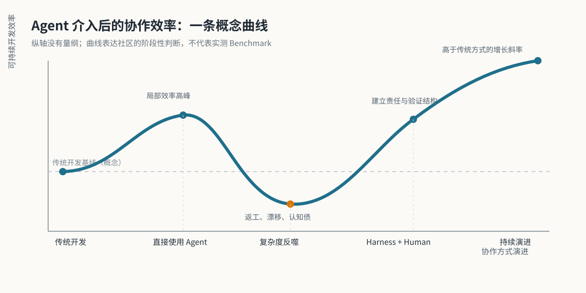

刚开始引入 Agent 时，代码产出迅速增加，人会获得一个很直观的小高峰。任务规模继续扩大以后，返工、回归、过度设计、协调成本和认知债开始反噬，端到端交付效率随之下降。有些团队在这个阶段甚至会觉得 Agent 越用越慢，因为生成速度已经不再是瓶颈，理解和收拾生成结果才是。

当我们按任务选择合适的 Harness，把约束、验证、状态和权限放回工程系统，同时建立以人为核心的计划与责任机制，效率会重新抬升。我们期待第二段上升的斜率高于传统开发：模型负责大规模执行，人负责问题定义、关键判断与最终交付，彼此的优势才真正接在一起。

这条图是一个概念模型，纵轴没有统一量纲，也没有一组社区 Benchmark 可以证明它。它更像一份等待验证的假设。后续整理如果能找到真实项目的交付周期、返工比例、缺陷率、维护成本和 Human Review 时间，这条曲线才有机会从感受变成数据。

### 这一章仍然没有结尾

截至 2026 年 8 月 5 日，DeepSeek-V4-Pro Preview 已经在 4 月公开，7 月 31 日转为正式版的是 V4 Flash。现在，社区开始期待与 `0731` 对应的 Pro 后续版本。

所以，这一章暂时停在一个开放的位置。模型会继续吸收今天的优秀 Flow，外部 Harness 也会继续删除已经被模型覆盖的结构；留下来的部分，大概率会更贴近垂直领域、组织责任和真实交付。每个开发者、每个团队都在形成自己的协作范式。Humanize 社区能够贡献的，也许正是把这些范式放回真实项目里反复实践，把成功与失败留下来，再让下一轮模型和工具继续把它们吃进去。

> 本章的群聊行号、官方 Model Card 与产品能力边界，见[第四章一手资料核查](materials/research/04_第四章_Harness方法论与责任制_一手资料核查.md)、[7 月 25 日 Arch—PM—Audit 与 Token 记录](materials/research/05_七月25日_ArchPMAudit与Subagent实践_一手资料核查.md)和[第四章参考资料卡](materials/references/04_第四章/README.md)。

## 附录 A｜Token 消耗的社区记录

### 先说能不能从图里算出来

这张流程图描述的是角色、模型档位和数据流，没有记录每个节点的输入 Token、输出 Token、缓存命中、调用次数、运行时长或账单金额。因此，Arch、PM、Audit、Contractor、Reviewer 和 K3 Worker 的消耗量无法从图中逐人还原，也不能把图里的节点数直接乘成总 Token。下面的数字来自群聊中的个人面板和口述，只能作为当时的观测样本。

### 7 月 25 日的一张个人面板

群里有人分享了自己写的 [`ai-usage`](https://github.com/SihaoLiu/ai-usage) 统计结果。原始 OCR 只留下了模型列表和两组占比：Claude 占 16% 的 Token、20% 的费用；Kimi 占 8% 的 Token、4% 的费用。GPT 占 40%、其余各家各占 20% 是当时对个人最终分布的预估，“总成本砍掉 50%”同样是预期，并非复盘结果。

| 模型 | Token 占比 | 费用占比 | 口径 |
| --- | ---: | ---: | --- |
| Claude | 16% | 20% | 个人几日混合任务快照 |
| Kimi | 8% | 4% | 个人几日混合任务快照 |
| GPT | 预计 40% | 未给出 | 个人预估，不是已实现结果 |
| 其他各家 | 预计各 20% | 未给出 | 个人预估，不是已实现结果 |

把该面板的总 Token 和总费用都归一为 100，可以得到一个有限但有用的相对指标：Claude 的“费用占比 / Token 占比”为 `20 / 16 = 1.25`，Kimi 为 `4 / 8 = 0.50`。在这个人的任务组合和价格口径下，Kimi 的相对成本密度约为 Claude 的 40%，也就是 Claude 约为 Kimi 的 2.5 倍。这个计算不能替代官方单价，也不能外推到其他模型版本；它只说明为什么群里会把 Kimi 放在 Build，把 GPT 留在 Reviewer 和 Gatekeeper 位置。[原始记录 L62823-L62866](/Users/zevorn/Downloads/jing/Humanize聊天记录_完整并行OCR_去重版.md:62823)

### 按时间留下的可比性较低的样本

| 时间 | 记录 | 可用的解释 |
| --- | --- | --- |
| 3 月 24 日 | 一位成员估算自己一个月的 API 等价费用超过 1 万美元，同时提到手里有两组 `$200` 订阅 | 订阅、反代和 API 口径混在一起，不能与后面的套餐消耗直接相加。[原文 L1520-L1545](/Users/zevorn/Downloads/jing/Humanize聊天记录_完整并行OCR_去重版.md:1520) |
| 5 月 17 日 | 一位成员说自己平均每天约 `1.2B` Token，做系统级实验还需要上千个数据点 | 这是个人研究预算感受，不是 Humanize 平均值。[原文 L22572-L22596](/Users/zevorn/Downloads/jing/Humanize聊天记录_完整并行OCR_去重版.md:22572) |
| 5 月 27 日 | 对话中出现 `5.7M/天`、`13.3M/周（20%）`，以及在一分钟测试回路下 `800M—1.3B/天` 的估计 | 说话人和条件在 OCR 中有粘连，后一个范围是条件推算，不能与前两项合并。[原文 L27541-L27575](/Users/zevorn/Downloads/jing/Humanize聊天记录_完整并行OCR_去重版.md:27541) |
| 6 月 18 日 | 一位成员记录 `codex:omh:claude = 71:16:13`，并预估之后会变成 `omh:codex:claude = 80:10:10` | 它反映的是一个人的模型入口分布；`omh` 在原文没有展开，不能强行当作统一产品名称。[原文 L45435-L45450](/Users/zevorn/Downloads/jing/Humanize聊天记录_完整并行OCR_去重版.md:45435) |
| 7 月 25 日 | 群里问“GPT 以外日均多少 B”，回答先后出现“1B 多一点”和“不到 2B” | OCR 把提问、回答和时间标签粘在一起，无法确认账户和统计窗口，只能保留为 B 级线索。[原文 L62930-L62940](/Users/zevorn/Downloads/jing/Humanize聊天记录_完整并行OCR_去重版.md:62930) |

### 套餐消耗更像压力测试记录

7 月中下旬的几条口述能说明消耗速度，却不能组成同口径账单：有人说国内 `¥699` 套餐一天用了 25% 周额度、5% 月额度；有人用 K3 Swarm 一天烧完 `¥199`，另一个人说一个 36 分钟的 `/goal` 用掉了 3% 周额度；7 月 19 日还有一次错误的 Sol 长任务，三个小时烧掉 30% 的 Codex 周额度和 20% 的 Kimi 周额度。随后有人报告高强度 K3 用掉 `$100 + $200`，也有人估算 Kimi 每周要烧 `1.5 × $200`，7 月 24 日又出现“一小时用掉 10% Codex 额度”的记录。套餐档位、地区、模型、是否使用 Swarm、统计周期都不同，这些数字适合用来观察“错误路径会吞掉多少预算”，不适合做模型排名。[7 月 17—18 日原文 L58095-L58124](/Users/zevorn/Downloads/jing/Humanize聊天记录_完整并行OCR_去重版.md:58095)；[7 月 19 日原文 L59329-L59330](/Users/zevorn/Downloads/jing/Humanize聊天记录_完整并行OCR_去重版.md:59329)；[7 月 21—24 日原文 L60061-L60408](/Users/zevorn/Downloads/jing/Humanize聊天记录_完整并行OCR_去重版.md:60061)

从这些零散数据里，暂时能得到三点判断：

- 图里的角色数量不等于 Token 预算。并行层级越多，输入上下文、同步和 Review 也会一起计费；Anthropic 对多 Agent 的公开估计是同任务约 3—10 倍 Token，但社群样本没有做同任务对照。
- 便宜模型承担 Build、较贵模型承担设计和 Review，是当时最清楚的一条个人实践规律。它优化的是“可接受产出 / 成本”，不是单纯追求更低的 Token 数。
- 一次错误路径可能比模型单价差异更快吞掉预算。后续若要做正式统计，至少应同时记录模型、角色、输入/输出/缓存 Token、费用、任务是否通过验收、返工轮次和人类介入时间；单看 Token 总量会把“烧得多但产出好”和“烧得多却走偏”混在一起。
